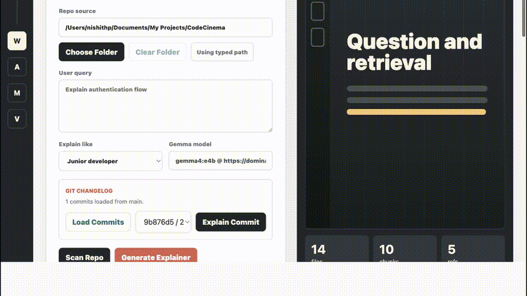
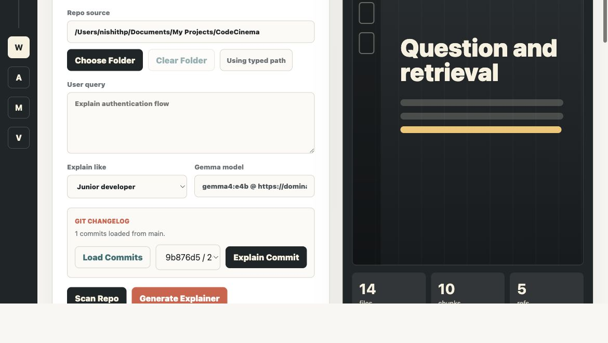
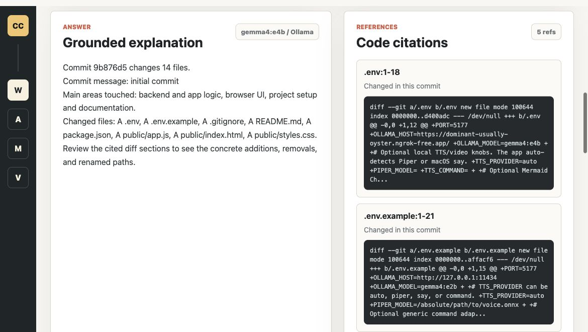
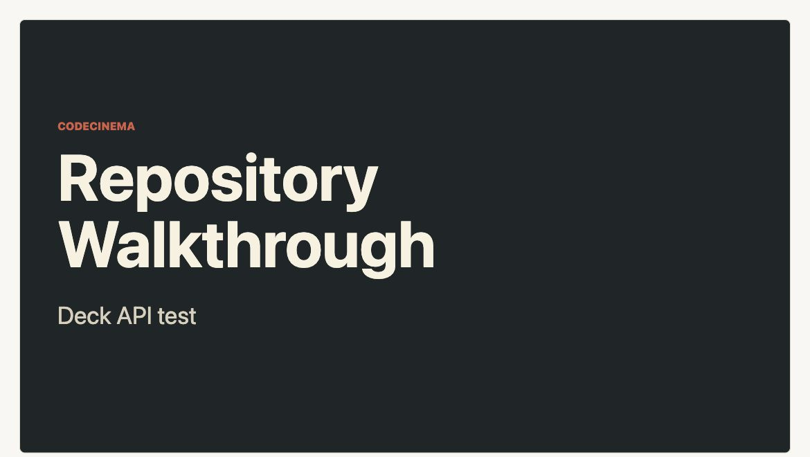
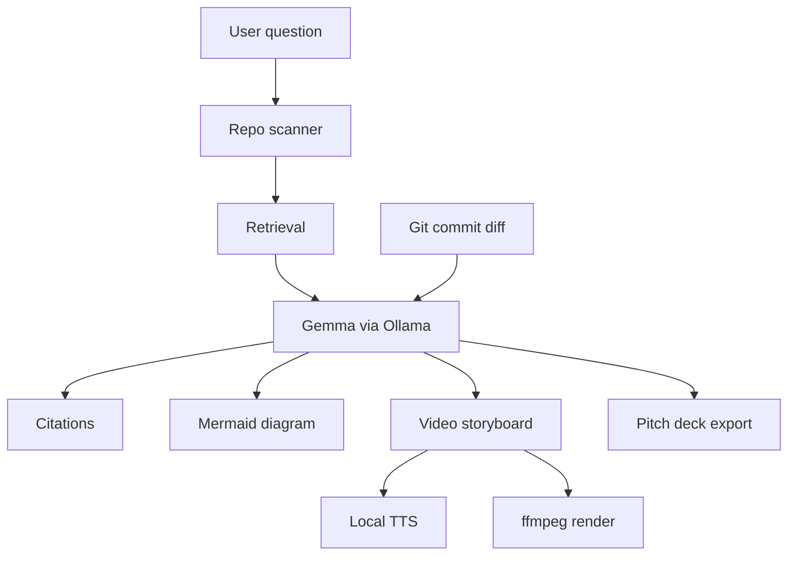

# CodeCinema

**Local AI that turns private codebases into explainable videos, pitch decks, diagrams, and changelogs.**

CodeCinema is built for a very real developer problem: companies are not comfortable sending proprietary code to public AI models. At the same time, AI coding agents are increasingly taking the steering wheel. They read files, make changes, generate patches, and we often respond by blindly clicking **accept** or **approve** without really understanding what happened.

CodeCinema makes that workflow explainable.

Instead of uploading a repo to a hosted model, CodeCinema runs locally with Ollama and Gemma. It scans a local repository, retrieves relevant code, generates citations, creates Mermaid diagrams, writes a narrated storyboard, renders an explainer video, exports a pitch deck, and can summarize Git commit diffs as changelog walkthroughs.

In short:

> CodeCinema makes vibe-coded software understandable, reviewable, and shareable without leaking the codebase.

## Demo

### Screen Recording



[Download MP4 walkthrough](docs/assets/app-walkthrough.mp4)

### Screenshots

**Repository explainer workspace**



**Commit changelog with cited diff references**



**Generated pitch deck**



## Why This Matters

AI coding tools are fast, but speed without understanding is risky.

Teams need answers to questions like:

- What did the agent actually change?
- Which files and functions matter?
- Why was this dependency, route, cache, queue, or database layer touched?
- What changed in this commit?
- Can we explain this internally without pasting the code into a public model?

CodeCinema addresses those questions by turning code understanding into an artifact:

- cited explanations
- Mermaid architecture and flow diagrams
- narrated explainer videos
- downloadable pitch decks
- Git commit changelog walkthroughs

That makes it useful for engineering onboarding, code review, incident review, security review, demos, and Buildathon-style storytelling.

## What It Does

- Scans a local repository and chunks readable source files.
- Retrieves relevant code for a user query.
- Uses Ollama with Gemma, for example `gemma4:e2b`, to generate grounded explanations.
- Cites filenames and line ranges.
- Generates Mermaid diagrams.
- Plans short, readable video scenes.
- Renders local narration and MP4 storyboard videos.
- Exports a standalone HTML pitch deck.
- Detects Git repositories and explains selected commits as changelogs.

## Architecture



## Run

```bash
npm run dev
```

Then open:

```text
http://localhost:5177
```

Recommended local environment:

```env
PORT=5177
OLLAMA_HOST=http://127.0.0.1:11434
OLLAMA_MODEL=gemma4:e2b
```

You can override per run:

```bash
OLLAMA_HOST=http://127.0.0.1:11434 OLLAMA_MODEL=gemma4:e2b npm run dev
```

## Main Flow

1. Enter a local repo path, or use **Choose Folder**.
2. Ask a question like `Explain authentication flow`.
3. Click **Generate Explainer**.
4. Review the cited answer, Mermaid diagram, and video scenes.
5. Click **Download Pitch Deck** or **Render Video**.

Browser folder selection sends readable source files to the local CodeCinema server with relative paths only. Browsers do not expose the absolute folder path, so typed path mode is still available when server-side scanning or Git history is needed.

## Git Changelog Mode

For typed local paths that are Git repositories:

1. Click **Load Commits**.
2. Pick a commit.
3. Click **Explain Commit**.

CodeCinema reads the selected commit diff, generates a changelog-style explanation, cites changed files, creates Mermaid/video scenes, and can export the same story as a pitch deck.

## Local TTS

CodeCinema uses provider detection:

1. `TTS_COMMAND` if configured.
2. Piper if `PIPER_MODEL` is configured and `piper` is installed.
3. macOS `say` as a local fallback.

For Piper:

```env
TTS_PROVIDER=piper
PIPER_MODEL=/absolute/path/to/voice.onnx
```

For Kokoro or another local command:

```env
TTS_PROVIDER=command
TTS_COMMAND=/path/to/tts-wrapper
```

The command receives:

```text
CODECINEMA_TTS_INPUT
CODECINEMA_TTS_OUTPUT
```

## Mermaid Chart

The app always generates Mermaid source and previews it in the browser when Mermaid JS can load. To sync through Mermaid Chart or a compatible internal endpoint, set:

```env
MERMAID_CHART_API_URL=
MERMAID_CHART_API_KEY=
```

The adapter posts:

```json
{
  "title": "Diagram title",
  "diagram": "flowchart TD..."
}
```

## Buildathon Positioning

**One-liner:** An AI-powered repository explainer that turns private codebases into narrated visual walkthroughs.

**Pitch:** CodeCinema gives teams the benefit of AI-powered code explanation without forcing them to share proprietary repositories with public AI systems. It makes autonomous coding agents more accountable by converting hidden code changes into cited, visual, narrated explanations that humans can actually review.

**Why now:** AI agents are writing more code, but engineering teams still need to understand and trust the changes. Local models make that possible inside private environments.
